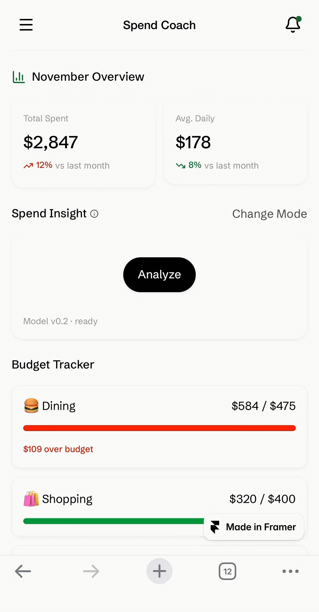

# Spend Coach — Real-Time Coaching UI (Block AI Fellowship Demo)

**Live Demo:** https://spendcoach.framer.website/  
**Case Study:** https://www.notion.so/2b0e379a996f80508d5bc81b14b25ce6?pvs=25  
**Figma File:** https://www.figma.com/design/zn0belzO8kskqc87FpOrUe/Spend-Coach?node-id=0-1&t=wOQ8htkGa449UuFD-1  
**Demo Video:** https://www.loom.com/share/38967a646b314854a7a33820274a972c  
**Hero GIF:** 

---

## Overview

Spend Coach explores how **real-time model feedback** can coach users toward healthier money habits.  
The prototype shows:
- A **Thinking → Result → Dismiss/Undo** loop with visible latency
- **Confidence + rationale chips** for transparency
- **Guardrails** (low-confidence state, slow fallback, error)
- **Controls** (Confirm, Edit, Dismiss/Undo)

> Goal: design for **trust, not magic** — every suggestion is explainable and reversible.

---

## How to Use (No Code)

1. Open the **Live Demo** link.  
2. On the Spend Coach screen, use the **Sample Events**:
   - Dining high
   - Shopping streak
   - Paycheck
   - Slow analysis
   - Analysis error
3. Watch the **Thinking** state for ~300–500 ms, then the **Result** state.
4. Try **Confirm / Edit / Undo**.
5. Notice the small chip: *Model v0.2 · ~320 ms · confidence 0.82*.

Screenshots are in `/assets/`.

---

## Scenarios & Messages

This prototype uses pre-baked responses to simulate model output.  
See `/data/model_responses.json` and `/data/transactions.json`.

- **Dining high** → high-confidence suggestion with rationale chips  
- **Shopping streak** → low-confidence suggestion with rationale chips 
- **Paycheck deposit** → “Pay yourself first” nudge  
- **Slow fallback** (>800ms) → safe default with clear copy  
- **Error** → suggestions disabled; manual controls visible

---

## Design Notes

- **Latency & Confidence** are visible to set expectations.  
- **Rationale chips** (“Weeknight increase”) replace long explanations.  
- **Undo** and **Edit** make suggestions safe and teachable.  
- **Modes:** Conservative / Balanced / Bold adjust thresholds (simulated).

---

## Responsible AI

- **Transparency:** version, latency, confidence shown inline.  
- **Safety rails:** graceful fallback when slow/uncertain.  
- **User agency:** accept, tweak, or undo any suggestion.  
- **Limitations:** demo uses simulated data and responses.

---

## File Map

/assets  
hero.gif  
demo.mp4  
spendcoach_home.png  
spendcoach_analysis.png  
/data  
transactions.json  
model_responses.json  
README.md  

---

## What I’d Explore Next

- Hooking telemetry to measure **accept**, **override**, and **dismiss** rates  
- **Multi-model routing** for budgeting vs. saving vs. cash-flow predictions  
- Creating **design system primitives** for “intelligent states” (thinking, rationale, uncertainty)

---

## License

MIT © Eileen Chou

